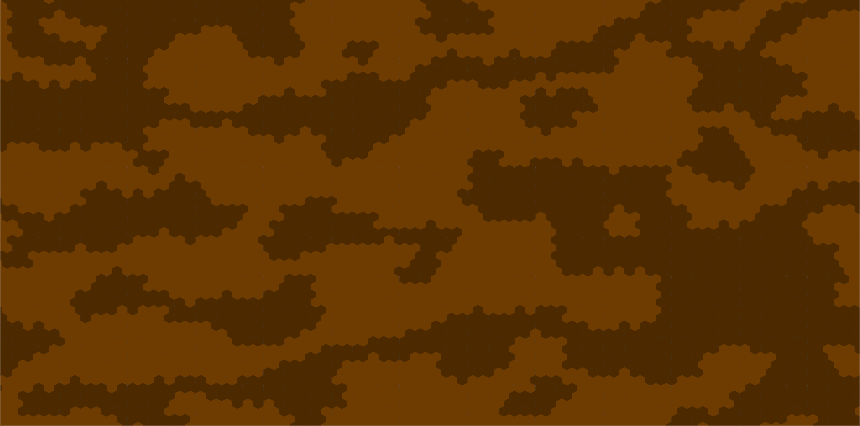
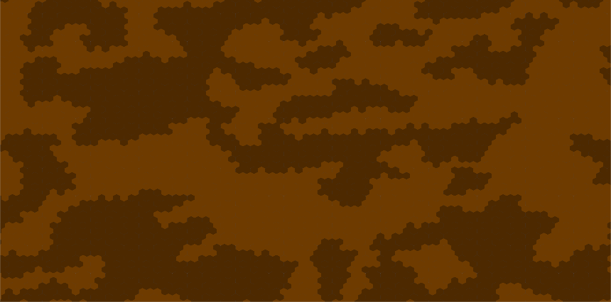

# HANNA

## Description

HANNA is a hexagrid cavern generation.

### Dependencies

- Unity 2018.3 or later.

### Features

 - [x] Hexagrid;
 - [x] Cave generation with a simple Cellular Automata (CA);
 - [ ] Genetict Algorithm (GA) for evolution of CA rules.

## Samples

	

		
		
	

## Author

 |
---|
[Breno Viana](https://github.com/brenov) |

## License

This project is licensed under MIT license - see the [MIT](LICENSE) file for details.
